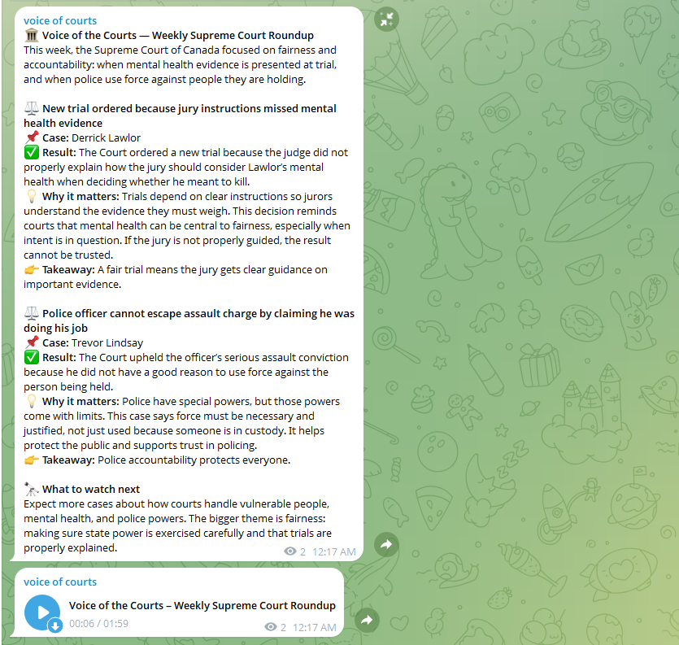

# Voice of the Courts

Turns new Canadian court decisions into a plain-language digest and a short audio episode, then posts both to a Telegram channel.

Data comes from [A2AJ Canadian Legal Data](https://a2aj.ca/canadian-legal-data/). Summaries are written by an LLM, audio by ElevenLabs.

```
A2AJ API  →  filter cases  →  LLM summaries + digest  →  MP3  →  Telegram
```

What lands in the channel, text digest followed by the audio episode:



## 1. Install

Needs Python 3.9 or newer.

```bash
cd voice-of-the-courts
pip install -r requirements.txt
```

## 2. Add your keys

```bash
cp .env.example .env
```

Open `.env` and paste your keys. The file says where to get each one. The default setup needs four:

| key | used for |
|---|---|
| `TOGETHER_API_KEY` | LLM summaries (Together AI) |
| `ELEVENLABS_API_KEY` | text-to-speech |
| `TELEGRAM_BOT_TOKEN` | posting to Telegram |
| `TELEGRAM_TEST_CHANNEL` | which channel to post to |

Check that the keys work:

```bash
python tests/13_keys_smoke.py
```

It makes one tiny call per key you filled in and prints OK or FAIL.

## 3. Set up Telegram

1. In Telegram, open `@BotFather`, send `/newbot`, follow the prompts. Copy the token into `.env` as `TELEGRAM_BOT_TOKEN`.
2. Create a channel. Open its settings, then Administrators, Add admin, pick your bot. It needs "Post messages".
3. Get the channel id. Public channel: use `@your_channel_name`. Private channel: forward any post from it to `@userinfobot` and copy the id starting with `-100`. Put it in `.env` as `TELEGRAM_TEST_CHANNEL`.

## 4. Run

Test run first. Uses two old cases and sends nothing to Telegram:

```bash
python run.py podcasts/scc_weekly_roundup.yaml --test
```

Real run, posts to Telegram:

```bash
python run.py podcasts/scc_weekly_roundup.yaml
```

Other options:

```bash
python run.py podcasts/scc_weekly_roundup.yaml --no-send   # everything except Telegram
python run.py --all                                        # every podcast in podcasts/
```

Cases already posted are remembered in `data/processed_<podcast>.json`, so running twice in one week does not repeat them. Audio files land in `data/audio/`.

## Podcasts

One YAML file per podcast in `podcasts/`:

| file | covers |
|---|---|
| `scc_weekly_roundup.yaml` | Supreme Court of Canada, weekly |
| `irb_refugee_weekly.yaml` | Immigration and Refugee Board decisions |
| `sst_disability_monitor.yaml` | Social Security Tribunal disability decisions |

Only the Supreme Court one has a `telegram:` section so far. To enable posting for another podcast, copy that block from `scc_weekly_roundup.yaml` to the end of its file.

## Run automatically every week

Add one line with `crontab -e`. This runs every Monday at 8:00:

```
0 8 * * 1 cd /full/path/to/voice-of-the-courts && python run.py --all >> data/run.log 2>&1
```

## Changing what a podcast does

Everything is in the YAML. The parts you are most likely to touch:

```yaml
podcast:
  audience: "general public with no legal background"   # who the LLM writes for
  tone: "plain-language, friendly, engaging"

filter:
  datasets: [SCC]          # which courts: SCC, FC, FCA, ONCA, BCCA, RAD, RPD, SST, ...
  date_range:
    last_n_days: 7
  max_results: 10

processing:
  models:
    fast:                  # summarizes each case
      provider: together_ai
      name: deepseek-ai/DeepSeek-V4-Flash-0731
    smart:                 # writes the final digest
      provider: together_ai
      name: Qwen/Qwen3.8-Flash

tts:
  provider: elevenlabs
  model: eleven_flash_v2_5   # cheapest ElevenLabs model; eleven_multilingual_v2 sounds better, costs 2x
  voice: alloy
```

Models go through [LiteLLM](https://docs.litellm.ai), so `provider` can be any LiteLLM provider: `openai`, `anthropic`, `groq`, `ollama` for local models, and more. Put the matching key in `.env`. Optional per-model settings: `temperature`, `max_tokens`, `api_base`, `api_key_env`, `stream`.

## Project layout

```
run.py              # command-line entry point
podcasts/           # one YAML per podcast
src/runner.py       # runs the stages in order
src/handlers/       # one file per stage: filter, processing, tts, telegram
data/               # dedup state and generated audio
docs/               # screenshots for this README
tests/              # numbered scripts; 09 and 12 run offline, 13 checks your keys
```

## Troubleshooting

- **`chat not found`**: the bot is not an admin of the channel, or the channel id is wrong.
- **`... is not in the environment`**: a key is missing from `.env`, or you ran from a different folder.
- **Telegram rejects the message**: the LLM produced unbalanced `*` or `_`. Set `parse_mode: ""` in the `telegram:` section to send plain text.
- **No cases found**: normal on quiet weeks. Widen `last_n_days` or `datasets` in the YAML.
